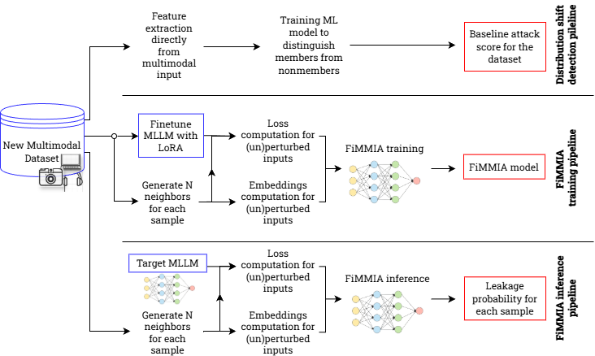

# FiMMIA: scaling semantic perturbation-based membership inference across modalities

<p align="center">
  <picture>
    
  </picture>
</p>

<p align="center">
    <a href="https://opensource.org/licenses/MIT">
    
    </a>
    <a href="https://github.com/ai-forever/data_leakage_detect/releases">
    
    </a>

</p>

This repository contains an implementation of **F**i**MMIA** - a modular **F**ramework for **M**ultimodal **M**embership **I**nference **A**ttacks (FiMMIA)

## Installation

Install the package in development mode:

```bash
pip install -e .
```

This will install the `fimmia` and `shift_detection` packages along with all dependencies, and make the CLI commands (`fimmia` and `shift-attack`) available in your PATH.

## Description
The system is the first collection of models and pipelines for membership inference attacks against multimodal large language models, built initially with a priority for the Russian language, and extendable to any other language or dataset. 
Pipeline supports different modalities: image, audio and video. In our experiments, we focus on [MERA datasets](https://github.com/MERA-Evaluation/MERA), however, the presented pipeline can be generalized to other languages. The system is a set of models and Python scripts in a GitHub repository. 

We support two major functionalities for image, audio and video modalities: inference of membership detection model and training pipeline for new datasets.

Pretrained models available on 🤗 HuggingFace [FiMMIA collection](https://huggingface.co/collections/ai-forever/fimmia).
## Distribution shift detection

Additionally, in [shift_detection](./shift_detection/) we release baseline attacks for multimodal data, tailored for distribution shift detection on target MIA datasets. Evaluation results as well as scripts for known datasets are provided in the respective folder. 

We encourage the community to run these baselines on their MIA benchmarks prior to their release or new methods evaluations to ensure fair and credible results.

We are grateful to [Das et al., 2024](https://arxiv.org/abs/2406.16201) for the initial text pipelines that has served as a base of this tool.

## Usage

### Command Line Interface

FiMMIA provides a structured CLI with subcommands. The recommended way to use FiMMIA is through the CLI commands:

#### Structured CLI (Recommended)

**Training:**
```bash
fimmia train \
  --train_dataset_path="train/mds/path" \
  --val_dataset_path="test/mds/path" \
  --model_name="FiMMIAModalityAllModelLossNormSTDV2" \
  --embedding_size=4096 \
  --modality_embedding_size=1024 \
  --output_dir="path/to/model/save" \
  --num_train_epochs=10
```

**Inference:**
```bash
fimmia infer \
  --model_name="FiMMIABaseLineModelLossNormSTDV2" \
  --model_path="path/to/model/save" \
  --test_path="test/mds/path" \
  --save_path="path/to/save/predictions.csv" \
  --save_metrics_path="path/to/save/metrics"
```

**Neighbor generation:**
```bash
fimmia neighbors \
  --model_path="ai-forever/FRED-T5-1.7B" \
  --dataset_path="path/to/train.csv" \
  --max_text_len=4000
```

**Embedding generation:**
```bash
fimmia embeds \
  --df_path="path/to/train.csv" \
  --embed_model="intfloat/e5-mistral-7b-instruct" \
  --max_seq_length=4096 \
  --modality_key=video \
  --device="cuda"
```

**Loss computation:**
```bash
# For image modality
fimmia loss image \
  --model_id=Qwen/Qwen2.5-VL-3B-Instruct \
  --model_name=Qwen2.5-VL-3B-Instruct \
  --label=0 \
  --df_path="path/to/train.csv"

# For video modality
fimmia loss video \
  --model_id=Qwen/Qwen2.5-VL-3B-Instruct \
  --model_name=Qwen/Qwen2.5-VL-3B-Instruct \
  --label=0 \
  --df_path="path/to/train.csv"

# For audio modality
fimmia loss audio \
  --model_id=Qwen/Qwen2-Audio-7B-Instruct \
  --model_name=Qwen2-Audio-7B-Instruct \
  --label=0 \
  --df_path="path/to/train.csv"
```

**SFT-LoRA finetuning:**
```bash
# Image
fimmia sft image \
  --train_df_path="path/to/train.csv" \
  --test_df_path="path/to/test.csv" \
  --num_train_epochs=5 \
  --model_id="Qwen/Qwen2.5-VL-3B-Instruct" \
  --output_dir="data/models/sft/Qwen2.5-VL-3B-Instruct"

# Video
fimmia sft video \
  --train_df_path="path/to/train.csv" \
  --test_df_path="path/to/test.csv" \
  --num_train_epochs=5 \
  --model_id="Qwen/Qwen2.5-VL-3B-Instruct" \
  --output_dir="data/models/sft/Qwen2.5-VL-3B-Instruct"

# Audio
fimmia sft audio \
  --train_df_path="path/to/train.csv" \
  --test_df_path="path/to/test.csv" \
  --num_train_epochs=5 \
  --model_id="Qwen/Qwen2.5-VL-3B-Instruct" \
  --output_dir="data/models/sft/Qwen2.5-VL-3B-Instruct"
```

**MDS dataset preparation:**
```bash
fimmia mds-dataset \
  --save_dir="path/to/save/mds/dataset" \
  --model_name="Qwen2.5-VL-3B-Instruct" \
  --origin_df_path="path/to/train.csv" \
  --labels="0,1" \
  --modality_key="video"
```

**Gradient attribution:**
```bash
fimmia attribute \
  --model_dir="path/to/fimmia_model_folder" \
  --mds_dataset_path="path/to/mds_dataset_folder" \
  --model_cls="BaseLineModelV2" \
  --embedding_size=4096 \
  --modality_embedding_size=1024
```

**Shift detection attacks:**

```bash
shift-attack \
  --dataset=bookmia \
  --attack=bag_of_words \
  --fpr_budget=1.0 \
  --plot_roc
```

```bash
shift-attack \
  --dataset=laion_mi_image \
  --attack=bag_of_visual_words \
  --fpr_budget=1.0 \
  --plot_roc \
  --hypersearch
```

#### Legacy Interface (Deprecated)

The `job_launcher.py` script is still available for backward compatibility but is deprecated. Use the structured CLI instead:

```bash
# Legacy (deprecated)
python job_launcher.py --script="fimmia.train" --train_dataset_path=...

# Recommended
fimmia train --train_dataset_path=...
```

### Python API

You can also use FiMMIA programmatically:

```python
from fimmia import (
    train,
    ModelArguments,
    DataTrainingArguments,
    DefaultTrainingArguments,
    NeighborsGenerator,
    NeighborsArgs,
    get_default_text_embedder,
    get_default_modality_embedder,
)

# Generate neighbors
args = NeighborsArgs(
    dataset_path="path/to/train.csv",
    model_path="ai-forever/FRED-T5-1.7B",
    max_text_len=4000
)
ng = NeighborsGenerator(args)
df = ng.predict(args.dataset_path)

# Get embedding models
text_embedder = get_default_text_embedder(
    model_name="intfloat/e5-mistral-7b-instruct",
    max_seq_length=4096
)
modality_embedder = get_default_modality_embedder(device="cuda")

# Train model
model_args = ModelArguments(
    model_name="FiMMIAModalityAllModelLossNormSTDV2",
    embedding_size=4096,
    modality_embedding_size=1024
)
data_args = DataTrainingArguments(
    train_dataset_path="train/mds/path",
    val_dataset_path="test/mds/path"
)
training_args = DefaultTrainingArguments(
    output_dir="path/to/model/save",
    num_train_epochs=10
)
trainer = train(model_args, data_args, training_args)
```

### Pipeline Overview
The inference pipeline is shown at image below.

<p align="center">
  <picture>
    
  </picture>
</p>

See examples of Finetuning and Inference Fimmia [here](examples/Finetune_and_Inference_example.ipynb)

### Data
For start working we should convert our dataset into pandas format with following structure:

| input | answer | audio | ds_name  |
|----------|--------|-------|----------|

* `input` example:

```text
Помогите мне, пожалуйста.

Есть задача такого типа. Задача на понимание музыки и невербальных аудио сигналов.

Имеется 1 аудиофайл

Аудиофайл: <audio>
Вопрос:
Сколько раз слышен сильный всплеск воды?

A. 10
B. 4
C. 12
D. 8

Определите ответ к задаче, учитывая, что первому из предложенных вариантов ответа присваивается литера А, второму литера B, третьему литера C и так далее по английскому алфавиту. В качестве ответа выведите, пожалуйста, литеру, соответствующую верному варианту ответа из предложенных. Финальный ответ прошу написать после слова ОТВЕТ (литера через пробел после этого слова).
```

* `answer` example: 'B'.
* `audio` - is the modality column. For video we should put `video`, for image - `image`.
* `ds_name` is the dataset name. For example `ruEnvAQA`.

### Training Pipeline
Whole pipeline contains the following steps:
1. SFT-Lora MLLM finetuning (if need)
2. Neighbor generation
3. **Embedding generation** – unified text + optional modality via `fimmia.embedding_models` (BaseEmbedder; default text: SentenceTransformer, default modality: ImageBind). When a modality column is used, both models are loaded before processing.
4. Loss computation
5. Attack model training
#### SFT-Lora MLLM finetuning
For finetuning, use the structured CLI (see examples above) or the legacy interface:

**Structured CLI (Recommended):**
```bash
fimmia sft image --train_df_path="..." --test_df_path="..." --model_id="..." --output_dir="..."
fimmia sft video --train_df_path="..." --test_df_path="..." --model_id="..." --output_dir="..."
fimmia sft audio --train_df_path="..." --test_df_path="..." --model_id="..." --output_dir="..."
```

**Legacy interface (Deprecated):**
```bash
python job_launcher.py --script="fimmia.sft_finetune_image" --train_df_path="..." ...
python job_launcher.py --script="fimmia.video.train_qwen25vl" --train_df_path="..." ...
python job_launcher.py --script="fimmia.audio.train_qwen2" --train_df_path="..." ...
```

Arguments:
* `train_df_path` - train dataset path
* `test_df_path` - test dataset path
* `model_id` - path to initial model
* `output_dir` - path for saving finetuning model
#### Neighbor generation 

**Structured CLI (Recommended):**
```bash
fimmia neighbors \
  --model_path="ai-forever/FRED-T5-1.7B" \
  --dataset_path="path/to/train.csv" \
  --max_text_len=4000
```

**Legacy interface (Deprecated):**
```bash
python job_launcher.py --script="fimmia.neighbors" \
  --model_path="ai-forever/FRED-T5-1.7B" \
  --dataset_path="path/to/train.csv" \
  --max_text_len=4000
```

Arguments:
* `model_path` - embedder model for masking neighbors generation
* `dataset_path` - path to dataset for generating neighbors
* `max_text_len` - max of text length in number of characters
#### Embedding generation (text + optional modality)
Embeddings are produced by a unified pipeline in `fimmia.embeds_joint`, which uses the **embedding_models** abstraction (`fimmia.embedding_models`): a **BaseEmbedder** interface for both text and modality. The default text embedder is SentenceTransformer (e.g. E5); the default modality embedder is ImageBind. When `--modality_key` is set, both the text and modality models are loaded **before** dataset processing starts.

**Structured CLI (Recommended):**
```bash
fimmia embeds \
  --df_path="path/to/train.csv" \
  --embed_model="intfloat/e5-mistral-7b-instruct" \
  --max_seq_length=4096 \
  --user_answer=0 \
  --modality_key=video \
  --device="cuda" \
  --part_size=5000 \
  --run_single_file=1
```

**Legacy interface (Deprecated):**
```bash
python job_launcher.py --script="fimmia.embeds_joint" \
  --df_path="path/to/train.csv" \
  --embed_model="intfloat/e5-mistral-7b-instruct" \
  --max_seq_length=4096 \
  --user_answer=0 \
  --modality_key=video \
  --device="cuda" \
  --part_size=5000 \
  --run_single_file=1
```

For **text-only** datasets, omit `--modality_key`. For **multimodal** data, set `--modality_key=image`, `--modality_key=video`, or `--modality_key=audio` to compute modality embeddings (ImageBind) in the same pass; the modality model is loaded once at startup.

Arguments:
* `df_path` – path to dataset CSV (must contain `neighbors` from the neighbor step)
* `embed_model` – text embedder model name or path (default: `intfloat/e5-mistral-7b-instruct`)
* `max_seq_length` – max sequence length for the text encoder (default: 4096)
* `user_answer` – if 1, neighbor text is `input + neighbor`; if 0, `neighbor + answer` (default: 0)
* `modality_key` – optional; column name for modality (`image` / `video` / `audio`) to embed in the same pass; omit for text-only
* `device` – device for text and modality models (default: `cuda`)
* `part_size` – lines per output part file (default: 5000)
* `run_single_file` – 1 to process only `df_path`; 0 to process all CSVs under `{df_path stem}_ng_parts/` (default: 1)

**Text-only vs multimodal:** If you omit `--modality_key`, the pipeline produces only text embeddings (no `{modality}_embeds/` folder). The FiMMIA attack model is then trained on **reduced input**: loss + text embedding only (no modality branch). Use the **BaseLine** model family (e.g. `FiMMIABaseLineModelLossNormSTDV2`). When you set `--modality_key`, both text and modality embeddings are produced; use the **ModalityAll** model family (e.g. `FiMMIAModalityAllModelLossNormSTDV2`) so the model receives loss + text embedding + modality embedding. The MDS dataset step and data collator handle both cases; modality-related arguments (e.g. `modality_embedding_size`) apply only when using ModalityAll models.

#### Loss computation

**Structured CLI (Recommended):**
```bash
# Image
fimmia loss image \
  --model_id=Qwen/Qwen2.5-VL-3B-Instruct \
  --model_name=Qwen2.5-VL-3B-Instruct \
  --label=0 \
  --df_path="path/to/train.csv" \
  --part_size=5000

# Audio
fimmia loss audio \
  --model_id=Qwen/Qwen2-Audio-7B-Instruct \
  --model_name=Qwen2-Audio-7B-Instruct \
  --label=0 \
  --df_path="path/to/train.csv" \
  --part_size=5000

# Video
fimmia loss video \
  --model_id=Qwen/Qwen2.5-VL-3B-Instruct \
  --model_name=Qwen/Qwen2.5-VL-3B-Instruct \
  --label=0 \
  --df_path="path/to/train.csv" \
  --part_size=5000
```

**Legacy interface (Deprecated):**
```bash
python job_launcher.py --script="fimmia.image.loss_calc" --model_id=... --model_name=... --label=0 --df_path=...
python job_launcher.py --script="fimmia.audio.loss_calc_qwen2" --model_id=... --model_name=... --label=0 --df_path=...
python job_launcher.py --script="fimmia.video.loss_calc_qwen25" --model_id=... --model_name=... --label=0 --df_path=...
```

Arguments:
* `model_id` - path to MLLM model
* `model_name` - name of MLLM model (used for storing results)
* `label` - label of dataset `0` or `1`
* `df_path` - path to dataset for calculating loss
* `part_size` - lines for splitting dataframe into smaller frames
#### Attack model training
Before training we need prepare data and merge all parts of files containing embeddings and losses:

**Structured CLI (Recommended):**
```bash
fimmia mds-dataset \
  --save_dir="path/to/save/mds/dataset" \
  --model_name="Qwen2.5-VL-3B-Instruct" \
  --origin_df_path="path/to/train.csv" \
  --shuffle=0 \
  --labels="0,1" \
  --modality_key="video" \
  --single_file=1
```

**Legacy interface (Deprecated):**
```bash
python job_launcher.py --script="fimmia.utils.mds_dataset" \
  --save_dir="path/to/save/mds/dataset" \
  --model_name="Qwen2.5-VL-3B-Instruct" \
  --origin_df_path="path/to/train.csv" \
  --shuffle=0 \
  --labels="0,1" \
  --modality_key="video" \
  --single_file=1
```

Arguments:
* `save_dir` - path for saving merged dataset
* `model_name` - name of MLLM model (used for storing results)
* `shuffle` - not shuffle data `0` or shuffle `1`
* `labels` - list of labels in dataset
* `modality_key` - modality column
* `single_file` - run on single file or batches

After data preparation run training of an attack model neural network FiMMIA:

**Structured CLI (Recommended):**
```bash
fimmia train \
  --train_dataset_path="train/mds/path" \
  --val_dataset_path="test/mds/path" \
  --model_name="FiMMIAModalityAllModelLossNormSTDV2" \
  --embedding_size=4096 \
  --modality_embedding_size=1024 \
  --output_dir="path/to/model/save" \
  --num_train_epochs=10 \
  --optim="adafactor" \
  --learning_rate=0.00005 \
  --max_grad_norm=10 \
  --warmup_ratio=0.03 \
  --sigmas_path="data/pd_datasets/video/sigmas.json" \
  --sigmas_type="std"
```

**Legacy interface (Deprecated):**
```bash
python job_launcher.py --script="fimmia.train" \
  --train_dataset_path="train/mds/path" \
  --val_dataset_path="test/mds/path" \
  --model_name="FiMMIAModalityAllModelLossNormSTDV2" \
  --embedding_size=4096 \
  --modality_embedding_size=1024 \
  --output_dir="path/to/model/save" \
  --num_train_epochs=10 \
  --optim="adafactor" \
  --learning_rate=0.00005 \
  --max_grad_norm=10 \
  --warmup_ratio=0.03 \
  --sigmas_path="data/pd_datasets/video/sigmas.json" \
  --sigmas_type="std"
```
Training arguments:
* `train_dataset_path` - path to train mds dataset
* `val_dataset_path` - path to test mds dataset
* `model_name` - FiMMIA architecture: use `FiMMIABaseLineModelLossNormSTDV2` for text-only (no modality); use `FiMMIAModalityAllModelLossNormSTDV2` when the MDS dataset includes modality embeddings
* `embedding_size` - text embedding dimension (default: 4096)
* `modality_embedding_size` - modality embedding dimension for ModalityAll models (default: 1024)
* `num_train_epochs` - number of training epochs
* `output_dir` - path to save FiMMIA model
* `optim` - pytorch optimizer name
* `learning_rate` - learning rate
* `max_grad_norm` - max gradient normalization
* `warmup_ratio` - warmup ratio for optimization
* `sigmas_path` - path for dict with normalization parameters
* `sigmas_type` - type of normalization

### Inference
For inference we repeat 2, 3, 4 steps from training stage:
2. Neighbor generation
3. Embedding generation
4. Loss computation

For inference FiMMIA model on new data:

**Structured CLI (Recommended):**
```bash
fimmia infer \
  --model_name="FiMMIABaseLineModelLossNormSTDV2" \
  --model_path="path/to/model/save" \
  --test_path="test/mds/path" \
  --save_path="path/to/save/predictions.csv" \
  --save_metrics_path="path/to/save/metrics"
```

**Legacy interface (Deprecated):**
```bash
python job_launcher.py --script="fimmia.fimmia_inference" \
  --model_name="FiMMIABaseLineModelLossNormSTDV2" \
  --model_path="path/to/model/save" \
  --test_path="test/mds/path" \
  --save_path="path/to/save/predictions.csv" \
  --save_metrics_path="path/to/save/metrics"
```

Arguments:
* `model_name` - name of FiMMIA neural network architecture
* `model_path` - path to load FiMMIA model
* `test_path` - path to test dataset
* `save_path` - path to save predictions
* `save_metrics_path` - path to save metrics

### Gradient attribution

We also support running an gradient-based feature attribution on the FiMMIA model, intended to calculate a relative impact of loss and embedding related parts. 
The pipeline saves results and provides an option to draw graphs of attrbution metrics. The results are saved into the same folder as an FiMMIA model.

To run attribution:

**Structured CLI (Recommended):**
```bash
fimmia attribute \
  --model_dir="path/to/fimmia_model_folder" \
  --mds_dataset_path="path/to/mds_dataset_folder" \
  --model_cls="BaseLineModelV2" \
  --embedding_size=4096 \
  --modality_embedding_size=1024 \
  --add_attribution_noise=False \
  --create_graphs=True
```

**Legacy interface (Deprecated):**
```bash
python job_launcher.py --script="fimmia.attribute_fimmia" \
  --model_dir="path/to/fimmia_model_folder" \
  --mds_dataset_path="path/to/mds_dataset_folder" \
  --model_cls="BaseLineModelV2" \
  --embedding_size=4096 \
  --modality_embedding_size=1024 \
  --add_attribution_noise=False \
  --create_graphs=True
```

Arguments:
* `model_cls` - name of a FiMMIA neural network architecture
* `model_dir` - path to load FiMMIA model
* `mds_dataset_path` - path to the dataset to attribute
* `embedding_size` - dimension of the embedding input
* `modality_embedding_size` - dimension of the modality embedding input (only used in case modal embeddings are used)
* `add_attribution_noise` - whether to use stochastic perturbations (e.g. NoiseTunnel) to enhance reliability of the method
* `create_graphs` - whether to create graphs of attribution results


### Authors
* Emelyanov Anton
* Kudriashov Sergei
* Alena Fenogenova

