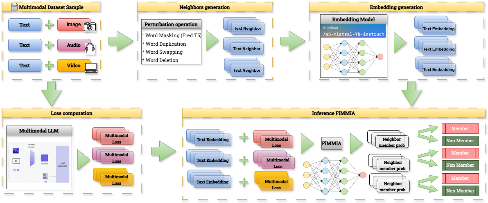

# FiMMIA: Framework for Multimodal Membership Inference Attacks


**FiMMIA** is a modular framework for membership inference attacks against multimodal large language models. It supports image, audio, and video modalities, making it the first comprehensive collection of models and pipelines for multimodal membership inference.

## Features

- **Multimodal Support**: Works with image, audio, and video data
- **Comprehensive Pipeline**: Complete training and inference workflows
- **CLI and Python API**: Use via command line or programmatically
- **Baseline Attacks**: Includes shift detection baselines for evaluation
- **Pre-trained Models**: Available on [HuggingFace](https://huggingface.co/collections/ai-forever/fimmia)

## Quick Links

- [Installation Guide](installation.md) - Get started with FiMMIA
- [Quick Start](quickstart.md) - Run your first membership inference attack
- [CLI Reference](usage/cli-reference.md) - Complete command reference
- [Python API](usage/python-api.md) - Programmatic usage examples
- [API Reference](api/fimmia.md) - Full API documentation

## What is Membership Inference?

Membership inference attacks aim to determine whether a specific data sample was used to train a machine learning model. This is crucial for:

- **Privacy Assessment**: Understanding what information models leak about training data
- **Security Evaluation**: Testing model robustness against privacy attacks
- **Compliance**: Ensuring models meet privacy requirements

## System Overview

FiMMIA implements a semantic perturbation-based approach to membership inference:

1. **Neighbor Generation**: Create semantically similar samples
2. **Embedding Generation**: Extract features from text and modalities
3. **Loss Computation**: Calculate model losses on original and neighbor samples
4. **Attack Model Training**: Train a classifier to distinguish members from non-members



## Getting Started

```bash
# Install FiMMIA
pip install -e .

# Run your first attack
fimmia train --train_dataset_path="path/to/train" --val_dataset_path="path/to/val" --output_dir="output"
```

See the [Quick Start Guide](quickstart.md) for more details.

## Documentation Structure

- **Usage Guides**: Learn how to use FiMMIA for training and inference
- **API Reference**: Complete documentation of all classes and functions
- **Tutorials**: Step-by-step guides for common tasks
- **Examples**: Code examples and notebooks

## Citation

If you use FiMMIA in your research, please cite:

```bibtex
@software{fimmia2024,
  title={FiMMIA: Framework for Multimodal Membership Inference Attacks},
  author={Emelyanov, Anton and Kudriashov, Sergei and Fenogenova, Alena},
  year={2024},
  url={https://github.com/ai-forever/data_leakage_detect}
}
```

## License

This project is licensed under the MIT License.

## Acknowledgments

We are grateful to [Das et al., 2024](https://arxiv.org/abs/2406.16201) for the initial text pipelines that served as a base for this tool.
